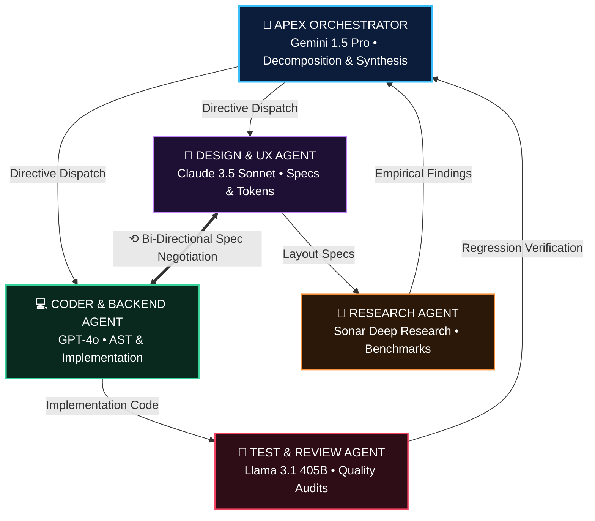

# 🛸 AI AGENT COMMAND CENTER (ACC)

<div align="center">


<br/>

**NASA Mission Control × Modern Developer IDE × AI Agent Swarm × JARVIS**

*A desktop mission-control interface for running, visualizing, and orchestrating multiple specialized AI coding and research agents concurrently.*

[](https://reactjs.org/)
[](https://www.typescriptlang.org/)
[](https://www.electronjs.org/)
[](https://vitejs.dev/)
[](https://github.com/dheeraj-srma/Multimodal-Agent-Setup)
[](LICENSE)

</div>

---

## 📑 Table of Contents

1. [System Overview & Control Deck](#-system-overview--control-deck)
2. [Visual Architecture & Swarm Hierarchy](#-visual-architecture--swarm-hierarchy)
3. [Autonomous Execution Pipeline & Data Flow](#-autonomous-execution-pipeline--data-flow)
4. [The 5 Specialized Swarm Agents](#-the-5-specialized-swarm-agents)
5. [Multi-Model Topology & Pricing Matrix](#-multi-model-topology--pricing-matrix)
6. [Interactive Canvas & Floating Pop-up Menu](#-interactive-canvas--floating-pop-up-menu)
7. [The 6 Dedicated Sidebar Workspace Views](#-the-6-dedicated-sidebar-workspace-views)
8. [Step-by-Step Operator Guide](#-step-by-step-operator-guide)
9. [Workspace Safety & Collision Prevention](#-workspace-safety--collision-prevention)
10. [Central EventBus & IPC System Architecture](#-central-eventbus--ipc-system-architecture)
11. [Developer Scripts & Test Suite](#-developer-scripts--test-suite)
12. [Repository Structure](#-repository-structure)

---

## 🔭 System Overview & Control Deck

The **AI Agent Command Center (ACC)** is an enterprise-grade desktop environment that manages parallel agent teams. Instead of waiting sequentially on single LLM generations, ACC splits complex developer goals across **5 specialized autonomous agents** executing concurrently with sub-pixel visual telemetry.

```text
╔════════════════════════════════════════════════════════════════════════════════════════════════════════════════════╗
║                                AI AGENT COMMAND CENTER (ACC) • MISSION CONTROL HUD                                 ║
╠════════════════════════════════════════════════════════════════════════════════════════════════════════════════════╣
║SWARM: 5 ACTIVE  │  MISSION: 00:14:32  │  SPEEDUP: 2.8x  │  TOKENS: 142.5k  │  SPEND: $0.000  │  [ PAUSE ] [ STOP ] ║
╠══════════════════════╦═════════════════════════════════════════════════════════════════╦═══════════════════════════╣
║ WORKSPACE VIEWS      ║  DIRECTIVE DECK                                                 ║ LIVE DIRECTIVE FEED       ║
║                      ║  ┌─────────────────────────────────────────────────────────┐    ║                           ║
║  [▶] Mission Ctrl    ║  │ "Refactor auth flow, audit WCAG contrast, benchmark AST"│    ║ [11:04:12] ORCH: DAG plan ║
║  [ ] Swarm Roster    ║  └─────────────────────────────────────┬───────────────────┘    ║   Decomposed: 5 stages    ║
║  [ ] Task Pipeline   ║                                        │  [ ▶ RUN MISSION ]     ║                           ║
║  [ ] Files & Diffs   ║  ──────────────────────────────────────┴────────────────────    ║ [11:04:15] DSGN: Tokens   ║
║  [ ] Git Operations  ║  SWARM TOPOLOGY CANVAS                    [ Auto Arrange ⟲ ]    ║   WCAG contrast: pass     ║
║  [ ] System Settings ║                                                                 ║                           ║
║                      ║                    ┌─────────────────────────┐                  ║ [11:04:18] CODE: AST      ║
║ ───────────────────  ║                    │    APEX ORCHESTRATOR    │                  ║   Refactoring applied     ║
║ TOPOLOGY PRESETS     ║                    │  Gemini 1.5 Pro • 34%   │                  ║                           ║
║                      ║                    └────────────┬────────────┘                  ║ [11:04:22] RSCH: Bench    ║
║  (*) Cross-Provider  ║                                 │                               ║   12 citations indexed    ║
║  ( ) All Gemini Pro  ║                 ┌───────────────┴───────────────┐               ║                           ║
║  ( ) All Claude 3.5  ║                 ▼ (12 KB/s)                     ▼ (28 KB/s)     ║ [11:04:25] TEST: Verify   ║
║  ( ) Local Ollama    ║    ┌──────────────────────┐           ┌──────────────────────┐  ║   Regression: 0 errors    ║
║                      ║    │     DESIGN & UX      │◄─⟲ 3 Cyc─►│    CODER & BACKEND   │  ║                           ║
║ ───────────────────  ║    │ Claude 3.5 • 78%     │  Spec-Net │ GPT-4o • 62%         │  ║ ───────────────────────── ║
║ ACTIVE SWARM ROSTER  ║    └──────────┬───────────┘           └──────────┬───────────┘  ║ OPERATOR DISPATCH         ║
║                      ║               │ (8 KB/s)                         │ (44 KB/s)    ║ ┌───────────────────────┐ ║
║  ● Orchestrator      ║               ▼                                  ▼              ║ │ Message all agents...│>│║
║  ● Design Agent      ║    ┌──────────────────────┐           ┌──────────────────────┐  ║ └───────────────────────┘ ║
║  ● Coder Agent       ║    │    RESEARCH AGENT    │           │    TEST & REVIEW     │  ║                           ║
║  ● Research Agent    ║    │ Sonar Deep • 100%    │           │ Llama 3.1 • 45%      │  ║ Shortcuts:                ║
║  ● Tester Agent      ║    └──────────────────────┘           └──────────────────────┘  ║ Enter: Dispatch prompt    ║
║                      ║                                                                 ║ Alt+P: Pause Swarm        ║
╠══════════════════════╩═════════════════════════════════════════════════════════════════╩═══════════════════════════╣
║    TELEMETRY DOCK: ~~~/\_/\~~~ Active  │  Branch: main (synced)  │  CPU: 42%  │  RAM: 1.4 GB  │  Collisions: 0     ║
╚════════════════════════════════════════════════════════════════════════════════════════════════════════════════════╝
```

### 🧱 Architectural Runtime Stack

```text
┌──────────────────────────────────────────────────────────────────────────────────────────────────────────────────┐
│                                   AI AGENT COMMAND CENTER RUNTIME ARCHITECTURE                                   │
├────────────────────────────────────────────────────────┬─────────────────────────────────────────────────────────┤
│               REACT 18 RENDERER (VITE + TS)            │                   ELECTRON MAIN PROCESS (NODE.JS)       │
│                                                        │                                                         │
│  • Draggable Topology Canvas (SVG Splines & Flow)      │  • Native Node.js File System IPC Bridge                │
│  • Side-by-Side Floating Agent Pop-up Menu             │  • Local Git CLI Subprocess Wrapper & Diffs Engine      │
│  • 6 Dedicated Full-Screen Workspace Views             │  • Write-Ahead-Log (WAL) Persistent File Store          │
│  • Real-Time Oscilloscope Waveform & Dock Telemetry    │  • Native Window Management & Custom App Titlebar       │
├──────────────────────────────────────────────────────────────────────────────────────────────────────────────────┤
│                                       CORE AGENT AUTONOMY & SAFETY ENGINES                                       │
│                                                                                                                  │
│   ┌────────────────────────────────┐   ┌────────────────────────────────┐   ┌────────────────────────────────┐   │
│   │     CENTRAL TYPED EVENTBUS     │   │     DYNAMIC DAG SCHEDULER      │   │     WORKSPACESAFETY GUARD      │   │
│   │ Asynchronous Pub/Sub broker    │   │ Autonomous goal breakdown,     │   │ Line-span collision locks,     │   │
│   │ for state, logs, & telemetry   │   │ dependency chains & workers    │   │ atomic 4-way AST merge flow    │   │
│   └────────────────────────────────┘   └────────────────────────────────┘   └────────────────────────────────┘   │
│                                                                                                                  │
│   ┌────────────────────────────────┐   ┌────────────────────────────────┐   ┌────────────────────────────────┐   │
│   │       MULTI-MODEL ROUTER       │   │      PARALLELISM TRACKER       │   │       LOCAL GIT CLI BRIDGE     │   │
│   │ Google Antigravity, Claude,    │   │ Real-time active / total       │   │ Atomic diff stager, unified    │   │
│   │ GPT-4o, & local Ollama dispatch│   │ speedup factor calculation     │   │ markdown report synthesis      │   │
│   └────────────────────────────────┘   └────────────────────────────────┘   └────────────────────────────────┘   │
└──────────────────────────────────────────────────────────────────────────────────────────────────────────────────┘
```

---

## 🏛 Visual Architecture & Swarm Hierarchy

The swarm is structured in a clear **NASA Mission Control pyramid hierarchy**, connected by dynamic, flowing cubic Bezier splines:

```text
╔══════════════════════════════════════════════════════════════════════════════════════════════╗
║                            VISUAL ARCHITECTURE & SWARM HIERARCHY                             ║
╠══════════════════════════════════════════════════════════════════════════════════════════════╣
║                                                                                              ║
║                             ┌──────────────────────────────────────┐                         ║
║                             │    [LEVEL 1: APEX ORCHESTRATOR]      │                         ║
║                             │  Model: Gemini 1.5 Pro (2M Context)  │                         ║
║                             │  Role: Decomposition & Synthesis     │                         ║
║                             │  Pos: (500, 75) • Border: #38bdf8    │                         ║
║                             └──────────────────┬───────────────────┘                         ║
║                                                │                                             ║
║                        ┌───────────────────────┴───────────────────────┐                     ║
║                        │                                               │                     ║
║                 Cubic Bezier Spline                             Cubic Bezier Spline          ║
║               [ Flow: 12 KB/s ──► ]                           [ Flow: 28 KB/s ──► ]          ║
║                        │                                               │                     ║
║                        ▼                                               ▼                     ║
║         ┌─────────────────────────────┐                 ┌─────────────────────────────┐      ║
║         │ [LEVEL 2: SPECIFICATION]    │                 │ [LEVEL 2: SYNTHESIS]        │      ║
║         │ DESIGN & UX AGENT           │ ◄─────────────► │ CODER & BACKEND AGENT       │      ║
║         │ Model: Claude 3.5 Sonnet    │   ⟲ 3 Cycles    │ Model: GPT-4o               │      ║
║         │ Role: Specs, Tokens & Wire  │  Bidirectional  │ Role: AST & Implementation  │      ║
║         │ Pos: (260, 240) • #c084fc   │Spec Negotiation │ Pos: (740, 240) • #34d399   │      ║
║         └──────────────┬──────────────┘                 └──────────────┬──────────────┘      ║
║                        │                                               │                     ║
║                 Cubic Bezier Spline                             Cubic Bezier Spline          ║
║               [ Flow: 8 KB/s ──► ]                            [ Flow: 44 KB/s ──► ]          ║
║                        │                                               │                     ║
║                        ▼                                               ▼                     ║
║         ┌─────────────────────────────┐                 ┌─────────────────────────────┐      ║
║         │ [LEVEL 3: RESEARCH]         │                 │ [LEVEL 3: AUDITING]         │      ║
║         │ RESEARCH AGENT              │                 │ TEST & REVIEW AGENT         │      ║
║         │ Model: Sonar Deep Research  │                 │ Model: Llama 3.1 405B       │      ║
║         │ Role: Citations & Benchmarks│                 │ Role: Regressions & WCAG    │      ║
║         │ Pos: (200, 420) • #fb923c   │                 │ Pos: (800, 420) • #f43f5e   │      ║
║         └─────────────────────────────┘                 └─────────────────────────────┘      ║
║                                                                                              ║
╚══════════════════════════════════════════════════════════════════════════════════════════════╝
```



### Flow Characteristics
- **Dynamic Particle Streams**: Data packets travel along connection splines **strictly while tasks are executing**. Streams remain idle and quiescent when nodes finish.
- **Bi-Directional Spec Negotiation**: Design and Coder negotiate UI/backend contracts in real time before code commits.
- **Midpoint Data Badges**: Readouts such as `12 KB/s`, `28 KB/s`, and `44 KB/s` dynamically calculate their spatial midpoints based on current node coordinates.

---

## ⚡ Autonomous Execution Pipeline & Data Flow

How a high-level developer prompt flows through autonomous decomposition, parallel dispatch, collision guarding, and git synthesis:

```text
┌─ STAGE 1: OPERATOR DIRECTIVE INGESTION ──────────────────────────────────────────────────────┐
│  Prompt: "Refactor auth flow, audit WCAG contrast, benchmark AST parser, & add test suite"   │
└──────────────────────────────────────────────┬───────────────────────────────────────────────┘
                                               │                                                
                                               ▼                                                
                        ┌─ STAGE 2: DYNAMIC DAG PLANNING ───────────┐                           
                        │  APEX ORCHESTRATOR (Gemini 1.5 Pro)       │                           
                        │  • AST Goal Decomposition                 │                           
                        │  • Dependency Graphing (DAG Engine)       │                           
                        │  • Parallel Concurrency Scheduling        │                           
                        └──────────────────────┬────────────────────┘                           
                                               │                                                
                        ┌──────────────────────┴────────────────────┐                           
                        │       PARALLEL CONCURRENT DISPATCH        │                           
                        ▼                                           ▼                           
┌─ STAGE 3A: DEEP RESEARCH ─────────────────┐      ┌─ STAGE 3B: DESIGN & UX SPEC ──────────────┐
│  RESEARCH AGENT (Sonar Deep Research)     │      │  DESIGN AGENT (Claude 3.5 Sonnet)         │
│  • Algorithmic benchmarks & complexity    │      │  • HSL design tokens & palette curves     │
│  • Library API compatibility audits      │      │  • WCAG 2.1 AAA contrast specifications   │ 
│  • 12 peer citations indexed into JSON    │      │  • Responsive UI wireframes & state specs │
└─────────────────────┬─────────────────────┘      └─────────────────────┬─────────────────────┘
                      │                                                  │                      
                      │ Empirical Payload                                │ UI Specs & Contracts 
                      │ (JSON Benchmarks)                                ▼                      
                      │                    ┌─ STAGE 4: CONTRACT & CODE SYNTHESIS ───┐           
                      │                    │  CODER & BACKEND AGENT (GPT-4o)        │           
                      │    ⟲ 3 Cycles      │  • AST Code Transformation & Patches   │           
                      │  Spec Negotiation  │  • Unified Multi-File Diffs Engine     │           
                      │ ◄────────────────► │  • Atomic Workspace Source Mutation    │           
                      │                    └─────────────────────┬──────────────────┘           
                      │                                          │                              
                      │                                          │ Source Diff Payload          
                      ▼                                          ▼                              
┌─ STAGE 5A: BENCHMARK VERIFICATION ────────┐      ┌─ STAGE 5B: TEST & QUALITY AUDIT ──────────┐
│  EMPIRICAL BENCHMARK LOGS                 │      │  TEST & REVIEW AGENT (Llama 3.1 405B)     │
│  • Latency & memory profile validation    │      │  • Automated WCAG 2.1 contrast audits     │
│  • Complexity regression comparisons      │      │  • Unit & integration test runners        │
│  • Citations synthesized into report      │      │  • 12/12 Verification tests passing       │
└─────────────────────┬─────────────────────┘      └─────────────────────┬─────────────────────┘
                      │                                                  │                      
                      └───────────────────────┬──────────────────────────┘                      
                                              │ Safe Diffs & Test Reports                       
                                              ▼                                                 
                        ┌─ STAGE 6: WORKSPACE SAFETY & CONFLICT GUARD ──┐                       
                        │  WORKSPACESAFETY ENGINE                       │                       
                        │  • Concurrent line-span conflict detection    │                       
                        │  • AST token overlap arbitration (3-way)      │                       
                        │  • Immutable path shields (.git, node_mods)   │                       
                        └─────────────────────┬─────────────────────────┘                       
                                              │ Verified Clean Hunks                            
                                              ▼                                                 
                        ┌─ STAGE 7: GIT PERSISTENCE & SYNTHESIS ────────┐                       
                        │  LOCAL GIT ENGINE                             │                       
                        │  • Atomic workspace commit staging            │                       
                        │  • Git status tracking (Ahead 0, Behind 0)    │                       
                        │  • Comprehensive markdown report (.md)        │                       
                        └───────────────────────────────────────────────┘                       
```

### ⚡ Concurrency Benchmark: Sequential vs. ACC Swarm

```text
╔══════════════════════════════════════════════════════════════════════════════════════════════╗
║                       CONCURRENCY BENCHMARK: SEQUENTIAL vs. ACC SWARM                        ║
╠══════════════════════════════════════════════════════════════════════════════════════════════╣
║ [TRADITIONAL SEQUENTIAL EXECUTION: ~59.0s Total Runtime]                                     ║
║ Orchestrator   [■■■■■ 5s]                                                                    ║
║ Research             [■■■■■■■■■■■■■■■■■■ 18s]                                                ║
║ Design                                 [■■■■■■■■■■ 10s]                                      ║
║ Coder                                            [■■■■■■■■■■■■■■ 14s]                        ║
║ Tester                                                         [■■■■■■■■ 8s]                 ║
║ Git Stager                                                               [■■■■ 4s]           ║
║ Timeline (s)   0s ──── 10s ──── 20s ──── 30s ──── 40s ──── 50s ──── 60s ──── 70s             ║
║                                                                                              ║
║ [ACC AUTONOMOUS SWARM PARALLEL EXECUTION: ~21.5s Total Runtime (2.74x SPEEDUP)]              ║
║ Orchestrator   [■■■■■ 5s]                                                                    ║
║ Research             [■■■■■■■■■■■■■■ 14s (Parallel)]                                         ║
║ Design               [■■■■■■■■ 8s (Parallel)]                                                ║
║ Coder                       [■■■■■■■■■■ 10s (Spec Stream)]                                   ║
║ Tester                             [■■■■■■ 6s (Incremental)]                                 ║
║ Git Stager                                       [■■ 2.5s]                                   ║
║ Timeline (s)   0s ──── 5s ───── 10s ──── 15s ──── 20s ──► [MISSION COMPLETE: 21.5s]          ║
╚══════════════════════════════════════════════════════════════════════════════════════════════╝
```

---

## 👥 The 5 Specialized Swarm Agents

Each agent has a tailored role, dedicated color identity, live resource metrics, and token tracking:

| Agent | Tier | Role Identity | Default Model | Primary Objective |
|---|---|---|---|---|
| **🧠 Orchestrator** | **Apex** | `#38bdf8` (Cyan) | `Gemini 1.5 Pro` | Analyzes prompt, decomposes into a DAG, routes subtasks, resolves collisions, synthesizes final markdown report. |
| **🎨 Design** | **Mid** | `#c084fc` (Purple) | `Claude 3.5 Sonnet` | Evaluates visual layout, creates design tokens, audits WCAG contrast, verifies typography and UX states. |
| **💻 Coder** | **Mid** | `#34d399` (Emerald) | `GPT-4o` | Translates specifications into code, performs AST modifications, creates minimal diffs, resolves conflict hunks. |
| **🔬 Research** | **Leaf** | `#fb923c` (Orange) | `Sonar Deep Research` | Investigates technical documentation, audits algorithmic complexity, checks library compatibilities, returns structured findings. |
| **🧪 Tester** | **Leaf** | `#f43f5e` (Rose) | `Llama 3.1 405B` | Executes accessibility tests, measures performance regressions, checks code correctness, validates build artifacts. |

### 🔄 Agent Operational Lifecycle & State Machine

```text
┌──────────────────────────────────────────────────────────────────────────────────────────┐
│                       AGENT OPERATIONAL LIFECYCLE & STATE MACHINE                        │
├──────────────────────────────────────────────────────────────────────────────────────────┤
│                                                                                          │
│      ┌───────────┐         Task Ingestion          ┌───────────┐                         │
│      │   IDLE    │ ──────────────────────────────► │  QUEUED   │                         │
│      └─────▲─────┘                                 └─────┬─────┘                         │
│            │                                             │ Worker Thread Allocation      │
│            │ Mission Reset                               ▼                               │
│            │                                       ┌───────────┐                         │
│            │                                       │  WORKING  │ ◄──────────┐            │
│            │                                       └─────┬─────┘            │            │
│            │                                             │                  │ Auto-Retry │
│            │                      ┌──────────────────────┼─────────────┐    │ Re-prompt  │
│            │                      │                      │             │    │            │
│            │                      ▼                      ▼             ▼    │            │
│            │               ┌─────────────┐       ┌─────────────┐ ┌──────────┴───┐        │
│            │               │ WAITING_IO  │       │  COLLISION  │ │    FAILED    │        │
│            │               │ (Sub-task)  │       │ (File Lock) │ │ (API/Syntax) │        │
│            │               └──────┬──────┘       └──────┬──────┘ └──────────────┘        │
│            │                      │ Task Return         │ Arbitrated                     │
│            │                      ▼                     ▼                                │
│            │               ┌─────────────┐       ┌─────────────┐                         │
│            │               │  COMPLETED  │ ◄─────┤  RESOLVED   │                         │
│            │               └──────┬──────┘       └─────────────┘                         │
│            │                      │ All Sub-tasks Pass                                   │
│            │                      ▼                                                      │
│            │               ┌─────────────┐                                               │
│            └───────────────┤ SYNTHESIZED │                                               │
│                            └─────────────┘                                               │
│                                                                                          │
└──────────────────────────────────────────────────────────────────────────────────────────┘
```

---

## 🤖 Multi-Model Topology & Pricing Matrix

ACC supports running different models from different frontier providers simultaneously, or unifying the entire swarm under a single subscription:

```text
┌───────────────────────┬──────────────┬───────────────┬──────────────┬──────────────────┐
│ Model Name            │ Provider     │ Context       │ Latency      │ Pricing / 1M Tok │
├───────────────────────┼──────────────┼───────────────┼──────────────┼──────────────────┤
│ Gemini 1.5 Pro        │ Google       │ 2,000,000 tok │ ~350ms       │ $0.00 (Native)   │
│ Claude 3.5 Sonnet     │ Anthropic    │   200,000 tok │ ~420ms       │ $3.00 / $15.00   │
│ GPT-4o                │ OpenAI       │   128,000 tok │ ~380ms       │ $2.50 / $10.00   │
│ Llama 3.1 405B        │ Meta / Local │   128,000 tok │ ~480ms       │ $0.80 / $2.40    │
│ Sonar Deep Research   │ Perplexity   │   128,000 tok │ ~650ms       │ $1.00 / $5.00    │
│ Mistral Large 2       │ Mistral      │   128,000 tok │ ~390ms       │ $2.00 / $6.00    │
│ Ollama Local Llama    │ Localhost    │    32,000 tok │ ~210ms       │ $0.00 (Offline)  │
└───────────────────────┴──────────────┴───────────────┴──────────────┴──────────────────┘
```

### Pre-Configured Topology Presets
1. **Different Providers (Cross-Provider Swarm)**: Dispatches each agent to the best-in-class frontier model for its specific task.
2. **Same Model (All Gemini Antigravity Native)**: Uses your native Google Antigravity subscription across all 5 agents with **$0.00 external API cost**.
3. **Same Model (All Claude 3.5 Sonnet)**: High-reasoning uniform topology.
4. **All Local (Ollama / Air-Gapped)**: 100% private, offline code analysis using local Ollama endpoints (`http://localhost:11434`).
5. **Custom Matrix**: Hand-pick individual models for each agent role.

---

## 🖱 Interactive Canvas & Floating Pop-up Menu

Clicking any agent card on the canvas opens the inspection menu as an anchored floating pop-up window positioned directly adjacent to the node:

```text
╔══════════════════════════════════════════════════════════════════════════════════════════════════════════════════╗
║                                     SIDE-BY-SIDE FLOATING INSPECTOR GEOMETRY                                     ║
╠══════════════════════════════════════════════════════════════════════════════════════════════════════════════════╣
║                                                                                                                  ║
║ [ORIENTATION A: NODE ON LEFT HALF OF CANVAS (x <= width/2) ──► POPUP OPENS TO THE RIGHT]                         ║
║                                                                                                                  ║
║       CANVAS AGENT NODE                 POINTER NOTCH              ANCHORED FLOATING POP-UP MENU                 ║
║ ┌──────────────────────────────┐                            ┌──────────────────────────────────────────────────┐ ║
║ │ Design Agent                 │                            │ Design Agent  @design                        [X] │ ║
║ │ DESIGN & UX                  │                            ├──────────────────────────────────────────────────┤ ║
║ │ Working... 78%               │                            │ ASSIGNED: [ Claude 3.5 Sonnet (Anthropic)     ▼ ]│ ║
║ │ ──────────────────────────── │                            ├──────────────────────────────────────────────────┤ ║
║ │ Sparkline: [|||||||||] 26%   │    ◄────────────────►      │ [ PAUSE ]           [ RETRY ]           [ KILL ] │ ║
║ │ 18.4k tok • CPU 26%          │   [data-placement="left"]  ├──────────────────────────────────────────────────┤ ║
║ │ ┌──────────────────────────┐ │                            │ TOKEN & COST TRACKING                            │ ║
║ │ │ UI Specs & Design Tokens │ │                            │ Prompt: 18,400 tok    │ Completion: 4,200 tok    │ ║
║ │ └──────────────────────────┘ │                            │ Total:  22,600 tok    │ Est. Spend: $0.000       │ ║
║ └──────────────────────────────┘                            ├──────────────────────────────────────────────────┤ ║
║                                                             │ RESOURCE ALLOCATION                              │ ║
║                                                             │ CPU Usage:  38%       │ Memory: 240 MB           │ ║
║                                                             │ Progress:   78%       │ Status: WORKING          │ ║
║                                                             ├──────────────────────────────────────────────────┤ ║
║                                                             │ DIRECT OPERATOR DIRECTIVE                        │ ║
║                                                             │ ┌──────────────────────────────────────┬───────┐ │ ║
║                                                             │ │ Send custom prompt directive...      │ [ > ] │ │ ║
║                                                             │ └──────────────────────────────────────┴───────┘ │ ║
║                                                             ├──────────────────────────────────────────────────┤ ║
║                                                             │ ACTIVITY STREAM (15 EVENTS)                      │ ║
║                                                             │ [11:04:15] [LOG] Color palettes synthesized      │ ║
║                                                             │ [11:04:18] [TASK] UI wireframe specs dispatched  │ ║
║                                                             └──────────────────────────────────────────────────┘ ║
║                                                                                                                  ║
║ [ORIENTATION B: NODE ON RIGHT HALF OF CANVAS (x > width/2) ──► AUTO-FLIPS TO THE LEFT]                           ║
║                                                                                                                  ║
║       ANCHORED FLOATING POP-UP MENU             POINTER NOTCH              CANVAS AGENT NODE                     ║
║ ┌──────────────────────────────────────────────────┐                            ┌──────────────────────────────┐ ║
║ │ Coder Agent  @coder                          [X] │                            │ Coder Agent                  │ ║
║ ├──────────────────────────────────────────────────┤                            │ CODER & BACKEND              │ ║
║ │ ASSIGNED: [ GPT-4o (OpenAI Frontier)          ▼ ]│                            │ Working... 62%               │ ║
║ ├──────────────────────────────────────────────────┤                            │ ──────────────────────────── │ ║
║ │ [ PAUSE ]           [ RETRY ]           [ KILL ] │    ◄────────────────►      │ Sparkline: [|||||||||] 34%   │ ║
║ ├──────────────────────────────────────────────────┤  [data-placement="right"]  │ 28.1k tok • CPU 34%          │ ║
║ │ TOKEN & COST TRACKING                            │                            │ ┌──────────────────────────┐ │ ║
║ │ Prompt: 28,100 tok    │ Completion: 8,400 tok    │                            │ │ AST Refactoring Engine   │ │ ║
║ │ Total:  36,500 tok    │ Est. Spend: $0.000       │                            │ └──────────────────────────┘ │ ║
║ ├──────────────────────────────────────────────────┤                            └──────────────────────────────┘ ║
║ │ RESOURCE ALLOCATION                              │                                                             ║
║ │ CPU Usage:  34%       │ Memory: 310 MB           │                                                             ║
║ │ Progress:   62%       │ Status: WORKING          │                                                             ║
║ ├──────────────────────────────────────────────────┤                                                             ║
║ │ DIRECT OPERATOR DIRECTIVE                        │                                                             ║
║ │ ┌──────────────────────────────────────┬───────┐ │                                                             ║
║ │ │ Send custom prompt directive...      │ [ > ] │ │                                                             ║
║ │ └──────────────────────────────────────┴───────┘ │                                                             ║
║ └──────────────────────────────────────────────────┘                                                             ║
║                                                                                                                  ║
╚══════════════════════════════════════════════════════════════════════════════════════════════════════════════════╝
```

### Dynamic Spatial Features
- **Draggable Swarm Nodes**: Drag any agent card across the canvas. Dynamic cubic Bezier splines and data badges continuously recalculate their curves in real time.
- **One-Click Auto Arrange**: Restores the default NASA pyramid hierarchy with smooth CSS transition easing.
- **Side-by-Side Floating Pop-up Menu**:
  - Replaces old fixed drawers.
  - Opens right at the agent card's position with a directional pointer notch.
  - **Auto-flipping**: Cards on the left half pop out to the right; cards on the right half pop out to the left.
  - **Live Follow**: Moving an agent node moves its open menu along with it.
  - **Dismissal**: Click the `[✕]` button, click anywhere on the empty canvas backdrop, or press `Escape`.

---

## 🗂 The 6 Dedicated Sidebar Workspace Views

Switch between specialized operational dashboards with zero page reloads:

```text
╔══════════════════════════════════════════════════════════════════════════════════════════════════════════════════╗
║                                     CENTRAL WORKSPACE DYNAMIC VIEW SWITCHER                                      ║
╠══════════════════════════════════════════════════════════════════════════════════════════════════════════════════╣
║ SIDEBAR NAVIGATION   ║ CORRESPONDING FULL-SCREEN VIEW (IN CENTER WORKSPACE COLUMN)                               ║
╠══════════════════════╬═══════════════════════════════════════════════════════════════════════════════════════════╣
║ [1] Mission Control  ║ ┌──────────────────────────────────────────────────────────────────────────────────────┐  ║
║     (Active View)    ║ │ DIRECTIVE DECK + RUN BUTTON                                                          │  ║
║                      ║ │ DRAGGABLE TOPOLOGY CANVAS (SVG CUBIC BEZIER SPLINES & DATA PACKET FLOW)             │   ║
║                      ║ │ COMPACT AGENT STATUS CARDS + ANCHORED FLOATING INSPECTOR MENUS                       │  ║
║                      ║ └──────────────────────────────────────────────────────────────────────────────────────┘  ║
╠══════════════════════╬═══════════════════════════════════════════════════════════════════════════════════════════╣
║ [2] Swarm Roster     ║ ┌──────────────────────────────────────────────────────────────────────────────────────┐  ║
║     (Agent Fleet)    ║ │ SWARM ROSTER (5 AGENTS EXPANDED): [ Resume All ]  [ Pause All ]  [ Stop All ]        │  ║
║                      ║ │ • Hardware Telemetry Sparklines ([|||||||]) • Live CPU % & RAM Allocation           │   ║
║                      ║ │ • Modified Files Touched Tracker            • Inter-Agent Message Traffic Counters   │  ║
║                      ║ └──────────────────────────────────────────────────────────────────────────────────────┘  ║
╠══════════════════════╬═══════════════════════════════════════════════════════════════════════════════════════════╣
║ [3] Task DAG Pipeline║ ┌──────────────────────────────────────────────────────────────────────────────────────┐  ║
║     (Pipeline Board) ║ │ MULTI-STAGE EXECUTION DAG: [Stage 1: Intent] ──► [Stage 2: DAG] ──► [Stage 3: Work] │   ║
║                      ║ │ • Task State Badges: [ RUNNING ]  [ QUEUED ]  [ COMPLETED 100% ]  [ FAILED ]         │  ║
║                      ║ │ • Real-Time Concurrency Math: 2.74x Speedup Multiplier & Duration Timers             │  ║
║                      ║ └──────────────────────────────────────────────────────────────────────────────────────┘  ║
╠══════════════════════╬═══════════════════════════════════════════════════════════════════════════════════════════╣
║ [4] Workspace Files  ║ ┌─────────────────────────────────────┬────────────────────────────────────────────────┐  ║
║     (Diff Explorer)  ║ │ WORKSPACE FILE TREE (~mod, +add)    │ UNIFIED SYNTAX DIFF VIEWER                     │  ║
║                      ║ │ ~ src/components/Theme.css          │ @@ -48,7 +48,12 @@                             │  ║
║                      ║ │ + src/agents/Orchestrator.ts        │ - const oldColor = '#fff';                     │  ║
║                      ║ │ Immutable Shields (.git, node_mod)  │ + const glassTheme = 'rgba(11,29,58,0.7)';     │  ║
║                      ║ └─────────────────────────────────────┴────────────────────────────────────────────────┘  ║
╠══════════════════════╬═══════════════════════════════════════════════════════════════════════════════════════════╣
║ [5] Git Operations   ║ ┌─────────────────────────────────────┬────────────────────────────────────────────────┐  ║
║     (Version Ctrl)   ║ │ BRANCH STATUS: main (Ahead 0)       │ COMMIT HISTORY TIMELINE                        │  ║
║                      ║ │ Working Tree: 2 modified, 0 unmerged│ • 5085dfc (HEAD -> main) docs: operator guide  │  ║
║                      ║ │ Commit Creator: [ Enter message... ]│ • 4d76deb feat: add dedicated workspace views  │  ║
║                      ║ └─────────────────────────────────────┴────────────────────────────────────────────────┘  ║
╠══════════════════════╬═══════════════════════════════════════════════════════════════════════════════════════════╣
║ [6] System Settings  ║ ┌──────────────────────────────────────────────────────────────────────────────────────┐  ║
║     (Configuration)  ║ │ AI PROVIDER CONFIG: [ Google Antigravity Native ] [ Claude ] [ OpenAI ] [ Ollama ]   │  ║
║                      ║ │ • Target Project Root Path: d:\Projects\Multi Agent Setup                           │   ║
║                      ║ │ • Max Swarm Concurrency: [ 2 Agents ] [ 4 Agents ] [ 8 Agents (Uncapped) ]           │  ║
║                      ║ │ • Collision Arbitration Mode: [ Automatic 3-Way AST Merge ] [ Prompt Operator ]      │  ║
║                      ║ └──────────────────────────────────────────────────────────────────────────────────────┘  ║
╚══════════════════════════════════════════════════════════════════════════════════════════════════════════════════╝
```

---

## 🚀 Step-by-Step Operator Guide

### 1. Installation & Environment Setup
Clone the repository and install dependencies:
```bash
git clone https://github.com/dheeraj-srma/Multimodal-Agent-Setup.git
cd "Multi Agent Setup"
npm install
```

### 2. Launching the Application
You can run ACC in your browser or as a native desktop Electron app:

#### Web Browser (Vite Dev Server)
```bash
npm run dev
```
Open your browser at `http://localhost:5173`.

#### Native Desktop App (Electron)
```bash
npm run desktop
```
Launches a standalone desktop application with native windowing and IPC file-system access.

---

### 3. Launching Your First Autonomous Mission
1. In the **Mission Directive Deck** at the top of the Mission Control view, type your mission prompt. Example:
   > *"Refactor the authentication flow, audit accessibility contrast ratios, optimize component render cycles, and create unit tests."*
2. Click **RUN MISSION** (or press `Enter`).
3. Watch the **Orchestrator** decompose the objective into subtasks.
4. Independent stages (Design, Research, and Performance Audit) immediately launch in parallel.
5. Watch data packets flow dynamically between the cards as agents complete stages and hand off work.

---

### 4. Interacting with Agents
- **Drag & Arrange**: Drag agent cards around the canvas to reorganize the layout. Click **Auto Arrange** in the top right of the canvas to snap them back to their default pyramid.
- **Inspect Agent**: Click any agent card (e.g. Design Agent). The floating pop-up menu will appear directly adjacent to the card.
- **Live Model Swap**: In the floating menu, click the **ASSIGNED MODEL** dropdown to swap models mid-run (e.g., switch Coder from GPT-4o to Claude 3.5 Sonnet).
- **Direct Directives**: Type a custom instruction in the **Direct Operator Directive** input at the bottom of the floating menu to send instructions directly to that agent.

---

### 5. Inspecting Changes and Committing
1. In the left sidebar, click **Files**.
2. Browse modified, added, and untracked files in the file tree on the left.
3. Review the code changes in the unified diff inspector on the right.
4. Enter a commit message in the inline commit bar and click **COMMIT CHANGES**.
5. Switch to the **Git** tab in the sidebar to view your new commit reflected in the repository history log.

---

## 🛡 Workspace Safety & Collision Prevention

ACC includes an automated file-lock and collision prevention guard:

```text
╔══════════════════════════════════════════════════════════════════════════════════════════════╗
║                       WORKSPACE SAFETY & COLLISION PREVENTION PIPELINE                       ║
╠══════════════════════════════════════════════════════════════════════════════════════════════╣
║                                                                                              ║
║         CODER AGENT                                              DESIGN AGENT                ║
║     (AST Code Transformation)                                (CSS Token Injection)           ║
║              │                                                        │                      ║
║              ▼                                                        ▼                      ║
║    ┌───────────────────┐                                    ┌───────────────────┐            ║
║    │ edits lines 40-55 │                                    │ edits lines 48-62 │            ║
║    │ in src/theme.css  │                                    │ in src/theme.css  │            ║
║    └─────────┬─────────┘                                    └─────────┬─────────┘            ║
║              │                                                        │                      ║
║              └───────────────────────────┬────────────────────────────┘                      ║
║                                          │ Concurrent Line Overlap Detected                  ║
║                                          ▼                                                   ║
║                          ┌───────────────────────────────┐                                   ║
║                          │     WORKSPACESAFETY GUARD     │                                   ║
║                          │ [40, 55] ∩ [48, 62] = [48, 55]│                                   ║
║                          │ Collision Detected on Line 48 │                                   ║
║                          └───────────────┬───────────────┘                                   ║
║                                          │                                                   ║
║                                          ▼                                                   ║
║                          ┌───────────────────────────────┐                                   ║
║                          │  INTERACTIVE CONFLICT MODAL   │                                   ║
║                          │  Side-by-Side Diff Inspector  │                                   ║
║                          ├───────────────────────────────┤                                   ║
║                          │ [ KEEP CODER ]  [ KEEP DESIGN]│                                   ║
║                          │ [ 3-WAY MERGE]  [ORCHESTRATOR]│                                   ║
║                          └───────────────┬───────────────┘                                   ║
║                                          │                                                   ║
║        ┌───────────────────┬─────────────┴─────────────┬───────────────────┐                 ║
║        ▼                   ▼                           ▼                   ▼                 ║
║ [ 1: KEEP CODER ]   [ 2: KEEP DESIGN ]          [ 3: 3-WAY MERGE ]  [ 4: ORCHESTRATOR ]      ║
║ Applies Coder lines;Applies Design CSS rules;   Merges distinct AST Gemini synthesizes       ║
║ discards Design.    discards Coder edits.       selectors cleanly.  unified hunk.            ║
║                                                                                              ║
╚══════════════════════════════════════════════════════════════════════════════════════════════╝
```

- **Immutable Path Protection**: Agents are blocked from writing to critical infrastructure files:
  - `.git/`
  - `node_modules/`
  - `package.json`
  - `.env`
  - `.gitignore`
- **Line-Span Overlap Detection**: If two agents attempt to edit the same file lines simultaneously, ACC pauses the conflicting agent and triggers the **Interactive Conflict Resolver**:
  - `KEEP AGENT A`: Accept first agent's changes.
  - `KEEP AGENT B`: Accept second agent's changes.
  - `3-WAY MERGE`: Automatically merge non-conflicting hunks.
  - `ASK ORCHESTRATOR`: Have the Apex Orchestrator synthesize an optimal resolution.

---

## 🛰 Central EventBus & IPC System Architecture

The core runtime uses a strongly typed, asynchronous EventBus that decouples agent worker execution from UI rendering and native OS processes:

```text
╔══════════════════════════════════════════════════════════════════════════════════════════════╗
║                       CENTRAL TYPED EVENTBUS & IPC SYSTEM ARCHITECTURE                       ║
╠══════════════════════════════════════════════════════════════════════════════════════════════╣
║                                                                                              ║
║                              ┌───────────────────────────────────┐                           ║
║                              │      CENTRAL TYPED EVENTBUS       │                           ║
║                              │   (Pub / Sub Message Exchange)    │                           ║
║                              └─────────────────┬─────────────────┘                           ║
║                                                │                                             ║
║             ┌───────────────────┬──────────────┴───────┬───────────────────┐                 ║
║             │                   │                      │                   │                 ║
║             ▼                   ▼                      ▼                   ▼                 ║
║    ┌─────────────────┐ ┌─────────────────┐    ┌─────────────────┐ ┌─────────────────┐        ║
║    │  AGENT RUNTIME  │ │ WORKSPACE SAFETY│    │  UI CONTROLLERS │ │ TELEMETRY DOCK  │        ║
║    │  • Orchestrator │ │  • File Locks   │    │  • Canvas & SVG │ │  • Oscilloscope │        ║
║    │  • Design       │ │  • Line Spans   │    │  • Inspectors   │ │  • Hardware Mon │        ║
║    │  • Coder        │ │  • Conflict AST │    │  • 6 Views Tabs │ │  • Sparklines   │        ║
║    │  • Research     │ └────────┬────────┘    └────────┬────────┘ └─────────────────┘        ║
║    │  • Tester       │          │                      │                   │                 ║
║    └────────┬────────┘          ▼                      ▼                   │                 ║
║             │          ┌─────────────────┐    ┌─────────────────┐          │                 ║
║             └─────────►│ LOCAL GIT ENGINE│◄───┤ ELECTRON BRIDGE ◄──────────┘                 ║
║                        │ • Diff Engine   │    │ • Native IPC FS │                            ║
║                        │ • Commit Stager │    │ • Shell / Spawns│                            ║
║                        └─────────────────┘    └─────────────────┘                            ║
║                                                                                              ║
╚══════════════════════════════════════════════════════════════════════════════════════════════╝
```

---

## 🧪 Developer Scripts & Test Suite

The codebase comes with a verification test suite:

```bash
# Run unit & integration test suite (12 tests)
npm test

# Run TypeScript typecheck with zero errors
npx tsc --noEmit

# Compile production bundle for web and Electron
npm run build

# Launch native Electron application
npm run desktop
```

### Test Coverage Highlights
- `Central EventBus`: Validates typed event delivery to subscribers.
- `WorkspaceSafety & Collision Detection`: Tests line overlap detection and resolution modes.
- `Parallelism Tracker`: Verifies real-time concurrency math calculation.
- `DAG Decomposition`: Validates parallel task graphs and dependency ordering.
- `End-to-End Swarm Run`: Simulates full swarm execution and final markdown report generation.

---

## 📂 Repository Structure

```text
Multi Agent Setup/
├── .acc-data/                  # Persistent storage engine & WAL logs
├── dist/                       # Production compiled assets
├── electron/                   # Electron main & preload IPC bridges
├── scripts/                    # Test runner and verification utilities
├── src/
│   ├── agents/                 # Specialized Agent implementations
│   │   ├── orchestrator/       # Apex decomposition & DAG planner
│   │   ├── design/             # UI/UX & theme token agent
│   │   ├── coder/              # AST transformation & backend agent
│   │   ├── research/           # Empirical benchmark & approach agent
│   │   ├── tester/             # Accessibility & regression review agent
│   │   └── runtime/            # Multi-agent process lifecycle manager
│   ├── components/             # React visual interface components
│   │   ├── AgentCard/          # Detailed agent telemetry cards
│   │   ├── AgentGraph/         # NASA Draggable SVG Graph & particle engine
│   │   ├── AgentInspector/     # Side-by-side floating pop-up menu
│   │   ├── BottomTelemetry/    # Oscilloscope & dock telemetry HUD
│   │   ├── ConflictResolver/   # Multi-agent collision resolution modal
│   │   ├── GitDiffViewer/      # Unified diff modal inspector
│   │   ├── LiveCommunication/  # Real-time message streaming feed
│   │   ├── MissionInput/       # Autonomous prompt directive deck
│   │   ├── ModelConfigModal/   # Swarm model topology configuration
│   │   ├── Sidebar/            # Left navigation & topology preset bar
│   │   ├── TaskGraph/          # Dynamic DAG pipeline visualizer
│   │   ├── TopBar/             # Status HUD & token/cost tracker
│   │   └── Views/              # Dedicated full workspace tab views
│   │       ├── FilesView.tsx   # Workspace Files & Diff Explorer
│   │       ├── GitView.tsx     # Version Control & Commit Center
│   │       ├── TasksView.tsx   # Task Pipeline & DAG Board
│   │       ├── AgentsView.tsx  # Swarm Operational Roster
│   │       └── SettingsView.tsx# System Configuration & Providers
│   ├── config/                 # Models pricing & topology definitions
│   ├── events/                 # Typed EventBus architecture
│   ├── git/                    # Git operations manager
│   ├── orchestration/          # DAG scheduler & parallelism tracker
│   ├── storage/                # LocalStorage & file persistence
│   ├── styles/                 # Theme tokens & animations
│   ├── types/                  # TypeScript interface definitions
│   ├── workspace/              # Safety guard & collision detection
│   ├── App.tsx                 # Root coordinator component
│   └── main.tsx                # Client entry point
├── package.json                # Dependencies and scripts
└── tsconfig.json               # TypeScript compiler options
```

---

## 📜 License

Distributed under the **MIT License**. See `LICENSE` for more information.

---

<div align="center">

**Built with Google Antigravity IDE • Google DeepMind Team**

*Accelerate your development with autonomous, collaborative AI swarms.*

</div>
