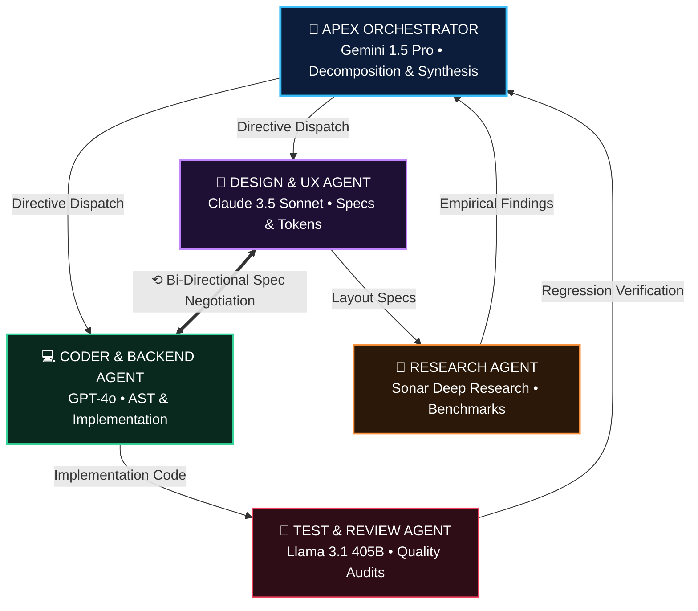

# 🛸 AI AGENT COMMAND CENTER (ACC)

<div align="center">


<br/>

**NASA Mission Control × Modern Developer IDE × AI Agent Swarm × JARVIS**

*A desktop mission-control interface for running, visualizing, and orchestrating multiple specialized AI coding and research agents concurrently.*

[](https://reactjs.org/)
[](https://www.typescriptlang.org/)
[](https://www.electronjs.org/)
[](https://vitejs.dev/)
[](https://github.com/dheeraj-srma/Multimodal-Agent-Setup)
[](LICENSE)

</div>

---

## 📑 Table of Contents

1. [System Overview](#-system-overview)
2. [Visual Architecture & Swarm Hierarchy](#-visual-architecture--swarm-hierarchy)
3. [The 5 Specialized Swarm Agents](#-the-5-specialized-swarm-agents)
4. [Multi-Model Topology & Pricing Matrix](#-multi-model-topology--pricing-matrix)
5. [Interactive Canvas & Floating Pop-up Menu](#-interactive-canvas--floating-pop-up-menu)
6. [The 6 Dedicated Sidebar Workspace Views](#-the-6-dedicated-sidebar-workspace-views)
7. [Step-by-Step Operator Guide](#-step-by-step-operator-guide)
8. [Workspace Safety & Collision Prevention](#-workspace-safety--collision-prevention)
9. [Developer Scripts & Test Suite](#-developer-scripts--test-suite)
10. [Repository Structure](#-repository-structure)

---

## 🔭 System Overview

The **AI Agent Command Center (ACC)** is an enterprise-grade desktop environment that manages parallel agent teams. Instead of waiting sequentially on single LLM generations, ACC splits complex objectives (e.g. *"Audit this project, formulate modern UI architecture, implement performance optimizations, and run accessibility regressions"*) across **5 specialized autonomous agents** running concurrently.

```text
┌──────────────────────────────────────────────────────────────────────────────────┐
│                            ACC DESKTOP RUNTIME STACK                             │
│                                                                                  │
│   ┌───────────────────────────────────┐        ┌─────────────────────────────┐   │
│   │     REACT 18 RENDERER (VITE)      │  IPC   │     ELECTRON MAIN PROCESS   │   │
│   │                                   │ ◄────► │                             │   │
│   │  - Draggable Multi-Model Canvas   │        │  - Native File System I/O   │   │
│   │  - Floating Agent Inspectors      │        │  - Local Git CLI Subprocess │   │
│   │  - 6 Dedicated Workspace Views    │        │  - WAL Persistent Storage   │   │
│   │  - Live Oscilloscope Waveforms    │        │  - Window Frame & Menus     │   │
│   └─────────────────┬─────────────────┘        └──────────────┬──────────────┘   │
│                     │                                         │                  │
│                     ▼                                         ▼                  │
│   ┌──────────────────────────────────────────────────────────────────────────┐   │
│   │                           CORE AGENT RUNTIME                             │   │
│   │                                                                          │   │
│   │   [ Central Typed EventBus ] ────► [ Dynamic DAG Scheduler ]             │   │
│   │   [ WorkspaceSafety Engine ] ────► [ Real-Time Parallelism Tracker ]     │   │
│   │   [ Multi-Model Router     ] ────► [ Local Static Heuristic Engine ]     │   │
│   └──────────────────────────────────────────────────────────────────────────┘   │
└──────────────────────────────────────────────────────────────────────────────────┘
```

---

## 🏛 Visual Architecture & Swarm Hierarchy

The swarm is structured in a clear **NASA Mission Control pyramid hierarchy**, connected by dynamic, flowing cubic Bezier splines:



### Flow Characteristics
- **Dynamic Particle Streams**: Data packets travel along connection splines **strictly while tasks are executing**. Streams remain idle and quiescent when nodes finish.
- **Bi-Directional Spec Negotiation**: Design and Coder negotiate UI/backend contracts in real time before code commits.
- **Midpoint Data Badges**: Readouts such as `12 KB/s`, `28 KB/s`, and `44 KB/s` dynamically calculate their spatial midpoints based on current node coordinates.

---

## 👥 The 5 Specialized Swarm Agents

Each agent has a tailored role, dedicated color identity, live resource metrics, and token tracking:

| Agent | Tier | Role Identity | Default Model | Primary Objective |
|---|---|---|---|---|
| **🧠 Orchestrator** | **Apex** | `#38bdf8` (Cyan) | `Gemini 1.5 Pro` | Analyzes prompt, decomposes into a DAG, routes subtasks, resolves collisions, synthesizes final markdown report. |
| **🎨 Design** | **Mid** | `#c084fc` (Purple) | `Claude 3.5 Sonnet` | Evaluates visual layout, creates design tokens, audits WCAG contrast, verifies typography and UX states. |
| **💻 Coder** | **Mid** | `#34d399` (Emerald) | `GPT-4o` | Translates specifications into code, performs AST modifications, creates minimal diffs, resolves conflict hunks. |
| **🔬 Research** | **Leaf** | `#fb923c` (Orange) | `Sonar Deep Research` | Investigates technical documentation, audits algorithmic complexity, checks library compatibilities, returns structured findings. |
| **🧪 Tester** | **Leaf** | `#f43f5e` (Rose) | `Llama 3.1 405B` | Executes accessibility tests, measures performance regressions, checks code correctness, validates build artifacts. |

---

## 🤖 Multi-Model Topology & Pricing Matrix

ACC supports running different models from different frontier providers simultaneously, or unifying the entire swarm under a single subscription:

```text
┌────────────────────────────────────────────────────────────────────────────────────────┐
│                              SUPPORTED MODEL MATRIX                                    │
├───────────────────────┬──────────────┬───────────────┬──────────────┬──────────────────┤
│ Model Name            │ Provider     │ Context       │ Latency      │ Pricing / 1M Tok │
├───────────────────────┼──────────────┼───────────────┼──────────────┼──────────────────┤
│ Gemini 1.5 Pro        │ Google       │ 2,000,000 tok │ ~350ms       │ $0.00 (Native)   │
│ Claude 3.5 Sonnet     │ Anthropic    │   200,000 tok │ ~420ms       │ $3.00 / $15.00   │
│ GPT-4o                │ OpenAI       │   128,000 tok │ ~380ms       │ $2.50 / $10.00   │
│ Llama 3.1 405B        │ Meta / Local │   128,000 tok │ ~480ms       │ $0.80 / $2.40    │
│ Sonar Deep Research   │ Perplexity   │   128,000 tok │ ~650ms       │ $1.00 / $5.00    │
│ Mistral Large 2       │ Mistral      │   128,000 tok │ ~390ms       │ $2.00 / $6.00    │
│ Ollama Local Llama    │ Localhost    │    32,000 tok │ ~210ms       │ $0.00 (Offline)  │
└───────────────────────┴──────────────┴───────────────┴──────────────┴──────────────────┘
```

### Pre-Configured Topology Presets
1. **Different Providers (Cross-Provider Swarm)**: Dispatches each agent to the best-in-class frontier model for its specific task.
2. **Same Model (All Gemini Antigravity Native)**: Uses your native Google Antigravity subscription across all 5 agents with **$0.00 external API cost**.
3. **Same Model (All Claude 3.5 Sonnet)**: High-reasoning uniform topology.
4. **All Local (Ollama / Air-Gapped)**: 100% private, offline code analysis using local Ollama endpoints (`http://localhost:11434`).
5. **Custom Matrix**: Hand-pick individual models for each agent role.

---

## 🖱 Interactive Canvas & Floating Pop-up Menu

```text
       ┌────────────────────┐
       │ 🎨 Design Agent    │ ◄─── (Click agent node to open menu)
       └─────────┬──────────┘
                 │
                 │   ┌──────────────────────────────────────────────┐
                 └──►│ 🎨 Design Agent @design                  [X] │
                     ├──────────────────────────────────────────────┤
                     │ ⚏ ASSIGNED: [Claude 3.5 Sonnet (Anthropic) v]│
                     ├──────────────────────────────────────────────┤
                     │ [> RESUME]      [⟲ RETRY]       [□ KILL]     │
                     ├──────────────────────────────────────────────┤
                     │ TOKEN & COST TRACKING                        │
                     │ Prompt: 18,400        Completion: 4,200      │
                     │ Total: 22,600         Spend: $0.000 (Native) │
                     ├──────────────────────────────────────────────┤
                     │ RESOURCE ALLOCATION                          │
                     │ CPU: 38%              Memory: 240 MB         │
                     │ Progress: 100%        State: COMPLETED       │
                     ├──────────────────────────────────────────────┤
                     │ ACTIVE ASSIGNMENT                            │
                     │ Design Glassmorphism Tokens & UI Specs       │
                     ├──────────────────────────────────────────────┤
                     │ DIRECT OPERATOR DIRECTIVE                    │
                     │ [Send custom prompt to Design Agent...   ] > │
                     └──────────────────────────────────────────────┘
```

### Dynamic Spatial Features
- **Draggable Swarm Nodes**: Drag any agent card across the canvas. Dynamic cubic Bezier splines and data badges continuously recalculate their curves in real time.
- **One-Click Auto Arrange**: Restores the default NASA pyramid hierarchy with smooth CSS transition easing.
- **Side-by-Side Floating Pop-up Menu**:
  - Replaces old fixed drawers.
  - Opens right at the agent card's position with a directional pointer notch.
  - **Auto-flipping**: Cards on the left half pop out to the right; cards on the right half pop out to the left.
  - **Live Follow**: Moving an agent node moves its open menu along with it.
  - **Dismissal**: Click the `[X]` button, click anywhere on the empty canvas backdrop, or press `Escape`.

---

## 🗂 The 6 Dedicated Sidebar Workspace Views

Switch between specialized operational dashboards with zero page reloads:

```text
┌─────────────────┐ ┌─────────────────────────────────────────────────────────────┐
│ 🛸 Mission Ctrl │ │ 1. MISSION CONTROL VIEW                                     │
│ 👥 Agents       │ │    Directive input deck, Draggable Topology Graph,          │
│ 📋 Tasks        │ │    Floating Inspectors, and Agent summary cards             │
│ 📂 Files        │ ├─────────────────────────────────────────────────────────────┤
│ 🌿 Git          │ │ 2. WORKSPACE FILES & UNIFIED DIFF EXPLORER                  │
│ ⚙️ Settings      │ │    Filterable file tree (~mod, +add, ?new), unified diff   │
│                 │ │    syntax viewer, copy button, and inline commit console    │
│                 │ ├─────────────────────────────────────────────────────────────┤
│                 │ │ 3. GIT VERSION CONTROL & REPO OPERATIONS                    │
│                 │ │    Branch ahead/behind status, commit history timeline,     │
│                 │ │    working tree changes, and repository commit engine       │
│                 │ ├─────────────────────────────────────────────────────────────┤
│                 │ │ 4. TASK PIPELINE & DAG BOARD                                │
│                 │ │    Multi-stage execution flow, dependency tracking,         │
│                 │ │    progress bars, stage duration, and artifact previews     │
│                 │ ├─────────────────────────────────────────────────────────────┤
│                 │ │ 5. ACTIVE AGENT SWARM ROSTER                                │
│                 │ │    Expanded 5-agent cards with CPU/memory sparklines,       │
│                 │ │    files touched, message counts, and swarm-wide controls   │
│                 │ ├─────────────────────────────────────────────────────────────┤
│                 │ │ 6. SYSTEM CONFIGURATION & PROVIDERS                         │
│                 │ │    Google Antigravity native status, API credentials,       │
│                 │ │    Ollama endpoints, concurrency limits, and safety paths   │
└─────────────────┘ └─────────────────────────────────────────────────────────────┘
```

---

## 🚀 Step-by-Step Operator Guide

### 1. Installation & Environment Setup
Clone the repository and install dependencies:
```bash
git clone https://github.com/dheeraj-srma/Multimodal-Agent-Setup.git
cd "Multi Agent Setup"
npm install
```

### 2. Launching the Application
You can run ACC in your browser or as a native desktop Electron app:

#### Web Browser (Vite Dev Server)
```bash
npm run dev
```
Open your browser at `http://localhost:5173`.

#### Native Desktop App (Electron)
```bash
npm run desktop
```
Launches a standalone desktop application with native windowing and IPC file-system access.

---

### 3. Launching Your First Autonomous Mission
1. In the **Mission Directive Deck** at the top of the Mission Control view, type your mission prompt. Example:
   > *"Refactor the authentication flow, audit accessibility contrast ratios, optimize component render cycles, and create unit tests."*
2. Click **RUN MISSION** (or press `Enter`).
3. Watch the **Orchestrator** decompose the objective into subtasks.
4. Independent stages (Design, Research, and Performance Audit) immediately launch in parallel.
5. Watch data packets flow dynamically between the cards as agents complete stages and hand off work.

---

### 4. Interacting with Agents
- **Drag & Arrange**: Drag agent cards around the canvas to reorganize the layout. Click **Auto Arrange** in the top right of the canvas to snap them back to their default pyramid.
- **Inspect Agent**: Click any agent card (e.g. Design Agent). The floating pop-up menu will appear directly adjacent to the card.
- **Live Model Swap**: In the floating menu, click the **ASSIGNED MODEL** dropdown to swap models mid-run (e.g., switch Coder from GPT-4o to Claude 3.5 Sonnet).
- **Direct Directives**: Type a custom instruction in the **Direct Operator Directive** input at the bottom of the floating menu to send instructions directly to that agent.

---

### 5. Inspecting Changes and Committing
1. In the left sidebar, click **Files**.
2. Browse modified, added, and untracked files in the file tree on the left.
3. Review the code changes in the unified diff inspector on the right.
4. Enter a commit message in the inline commit bar and click **COMMIT CHANGES**.
5. Switch to the **Git** tab in the sidebar to view your new commit reflected in the repository history log.

---

## 🛡 Workspace Safety & Collision Prevention

ACC includes an automated file-lock and collision guard:
- **Immutable Path Protection**: Agents are blocked from writing to critical infrastructure files:
  - `.git/`
  - `node_modules/`
  - `package.json`
  - `.env`
  - `.gitignore`
- **Line-Span Overlap Detection**: If two agents attempt to edit the same file lines simultaneously, ACC pauses the conflicting agent and triggers the **Interactive Conflict Resolver**:
  - `KEEP AGENT A`: Accept first agent's changes.
  - `KEEP AGENT B`: Accept second agent's changes.
  - `3-WAY MERGE`: Automatically merge non-conflicting hunks.
  - `ASK ORCHESTRATOR`: Have the Apex Orchestrator synthesize an optimal resolution.

---

## 🧪 Developer Scripts & Test Suite

The codebase comes with a verification test suite:

```bash
# Run unit & integration test suite (12 tests)
npm test

# Run TypeScript typecheck with zero errors
npx tsc --noEmit

# Compile production bundle for web and Electron
npm run build

# Launch native Electron application
npm run desktop
```

### Test Coverage Highlights
- `Central EventBus`: Validates typed event delivery to subscribers.
- `WorkspaceSafety & Collision Detection`: Tests line overlap detection and resolution modes.
- `Parallelism Tracker`: Verifies real-time concurrency math calculation.
- `DAG Decomposition`: Validates parallel task graphs and dependency ordering.
- `End-to-End Swarm Run`: Simulates full swarm execution and final markdown report generation.

---

## 📂 Repository Structure

```text
Multi Agent Setup/
├── .acc-data/                  # Persistent storage engine & WAL logs
├── dist/                       # Production compiled assets
├── electron/                   # Electron main & preload IPC bridges
├── scripts/                    # Test runner and verification utilities
├── src/
│   ├── agents/                 # Specialized Agent implementations
│   │   ├── orchestrator/       # Apex decomposition & DAG planner
│   │   ├── design/             # UI/UX & theme token agent
│   │   ├── coder/              # AST transformation & backend agent
│   │   ├── research/           # Empirical benchmark & approach agent
│   │   ├── tester/             # Accessibility & regression review agent
│   │   └── runtime/            # Multi-agent process lifecycle manager
│   ├── components/             # React visual interface components
│   │   ├── AgentCard/          # Detailed agent telemetry cards
│   │   ├── AgentGraph/         # NASA Draggable SVG Graph & particle engine
│   │   ├── AgentInspector/     # Side-by-side floating pop-up menu
│   │   ├── BottomTelemetry/    # Oscilloscope & dock telemetry HUD
│   │   ├── ConflictResolver/   # Multi-agent collision resolution modal
│   │   ├── GitDiffViewer/      # Unified diff modal inspector
│   │   ├── LiveCommunication/  # Real-time message streaming feed
│   │   ├── MissionInput/       # Autonomous prompt directive deck
│   │   ├── ModelConfigModal/   # Swarm model topology configuration
│   │   ├── Sidebar/            # Left navigation & topology preset bar
│   │   ├── TaskGraph/          # Dynamic DAG pipeline visualizer
│   │   ├── TopBar/             # Status HUD & token/cost tracker
│   │   └── Views/              # Dedicated full workspace tab views
│   │       ├── FilesView.tsx   # Workspace Files & Diff Explorer
│   │       ├── GitView.tsx     # Version Control & Commit Center
│   │       ├── TasksView.tsx   # Task Pipeline & DAG Board
│   │       ├── AgentsView.tsx  # Swarm Operational Roster
│   │       └── SettingsView.tsx# System Configuration & Providers
│   ├── config/                 # Models pricing & topology definitions
│   ├── events/                 # Typed EventBus architecture
│   ├── git/                    # Git operations manager
│   ├── orchestration/          # DAG scheduler & parallelism tracker
│   ├── storage/                # LocalStorage & file persistence
│   ├── styles/                 # Theme tokens & animations
│   ├── types/                  # TypeScript interface definitions
│   ├── workspace/              # Safety guard & collision detection
│   ├── App.tsx                 # Root coordinator component
│   └── main.tsx                # Client entry point
├── package.json                # Dependencies and scripts
└── tsconfig.json               # TypeScript compiler options
```

---

## 📜 License

Distributed under the **MIT License**. See `LICENSE` for more information.

---

<div align="center">

**Built with Google Antigravity IDE • Google DeepMind Team**

*Accelerate your development with autonomous, collaborative AI swarms.*

</div>
